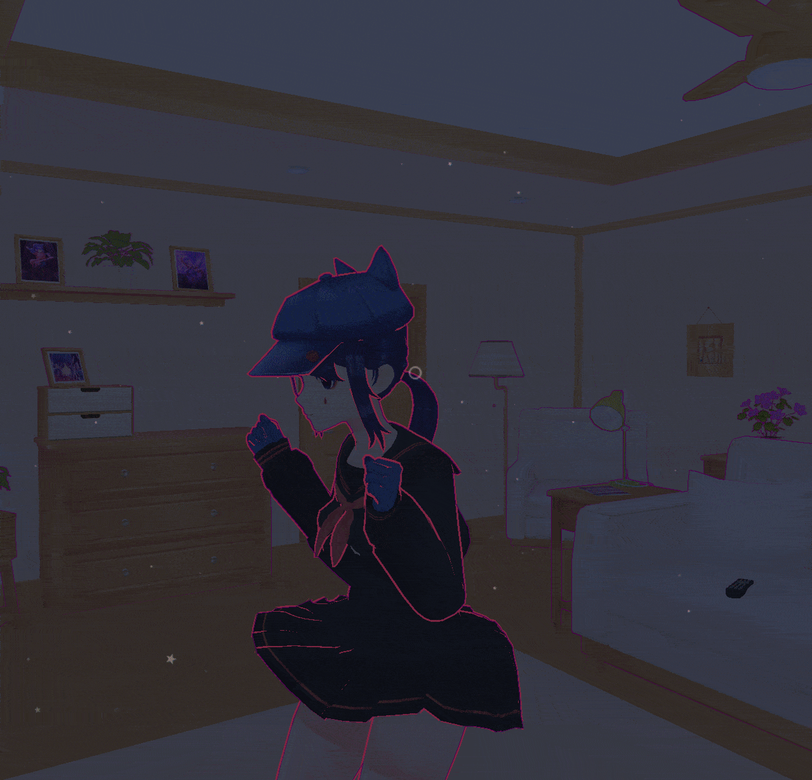

# MiSide-Sit-Unlocker

## Gif preview

  
Может содержать спойлеры! (May contain spoilers!)

    

## Описание мода

Разблокирует возможность приседать на клавишу LCtrl (левый контрол).

## Установка мода

- Установить один из поддерживаемых загрузчиков

  - [MelonLoader](https://github.com/LavaGang/MelonLoader/releases)
    - Просто используйте **установщик** последней версии
  - [BepInEx](https://github.com/BepInEx/BepInEx/releases)
    - Нам нужен **BepInEx-Unity.IL2CPP-win-x64-6.x.x** (6-ая версия)
    - Распакуйте содержимое архива в папку с игрой

- Скачать [последнюю версию мода](https://github.com/MrSago/MiSide-Sit-Unlocker/releases) **под нужный загрузчик:**

  - SitUnlocker.MelonLoader.zip - для MelonLoader
  - SitUnlocker.BepInEx.zip - для BepInEx

- Извлечь файлы из архива в папку с игрой

- Веселитесь

## Mod Description

Unlocks the ability to sit down with the LCtrl (left control) key.

## Mod installation

- Install one of the supported mod loaders

  - [MelonLoader](https://github.com/LavaGang/MelonLoader/releases)
    - Just use the latest version **installer**
  - [BepInEx](https://github.com/BepInEx/BepInEx/releases)
    - We need **BepInEx-Unity.IL2CPP-win-x64-6.x.x** (6th version)
    - Unzip the contents of the archive into the game folder

- Download [the latest version of the mod](https://github.com/MrSago/MiSide-Sit-Unlocker/releases) **for the required loader:**

  - SitUnlocker.MelonLoader.zip - for the MelonLoader
  - SitUnlocker.BepInEx.zip - for the BepInEx

- Extract files from the archive into the game folder

- Have fun
